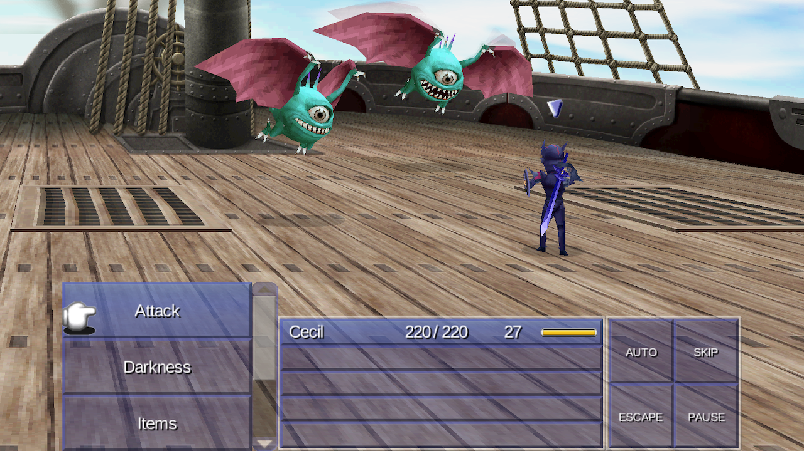

# Final Fantasy IV (3D Remake) Nintendo Switch Port
<p align="center"></p>

## Overview
This software is an unofficial, fan-made wrapper that allows for the AARCH64 Android version of Final Fantasy IV (3D Remake) to run natively on the Nintendo Switch with modern enhancements.

## Changelog
### 1.0.4
- Fixed launcher sound
- Fixed launcher crash
### 1.0.3
- Font Scale Option
- Updated [Movie Player](https://github.com/NaGaa95/ff4_3d_nx/blob/main/source/movie_player.c)
- Updated [Audio Engine](https://github.com/NaGaa95/ff4_3d_nx/blob/main/source/opensles.c)
- Improved UI Customization
- UI Fixes
### 1.0.2
- Changed file paths
- Changed default config values
### 1.0.1
- Font-related bugfixes and improvements
### 1.0.0
- Improved stick movement
- Full achievement support
- In-game overlay menu
- Per user savefiles
- Debug menu
- User interface
- Adjustable speed
- Opening video playback
- Local multiplayer
- Boosts
  - Encounters (On/Off)
  - EXP multiplier (0.5x/1x/2x/4x)
  - Gil multiplier (0.5x/1x/2x/4x)
- Cheats
  - Save anywhere
  - Remove NG+ limit
  - Guaranteed encounter
  - Equip anything
  - Reobtainable limit break
  - Augmentless stat growth
- Controller rumble
- Customizable controls
- Mods [(see below)](#mod-development)
- Fonts [(see below)](#font-installation)
- Pause battle keybind
- Accessible chocobo menu from anywhere
- Fixed title screen navigation

## Controls
All controls can be viewed and modified within the overlay menu.
| Default Core Controls | Pro Controller | Left Joy-Con (Vertical) | Left Joy-Con (Horizontal) | Right Joy-Con (Vertical) | Right Joy-Con (Horizontal) |
| :--- | :--- | :--- | :--- | :--- | :--- |
| **Select** | A | D-Pad Right | D-Pad Down | A | X |
| **Cancel** | B | D-Pad Down | D-Pad Left | B | A |
| **Left** | D-Pad Left | Left Stick Left | Left Stick Up | Right Stick Left | Right Stick Down |
| **Right** | D-Pad Right | Left Stick Right | Left Stick Down | Right Stick Right | Right Stick Up |
| **Up** | D-Pad Up | Left Stick Up | Left Stick Right | Right Stick Up | Right Stick Left |
| **Down** | D-Pad Down | Left Stick Down | Left Stick Left | Right Stick Down | Right Stick Right |
| **Prev page - Change targeted party** | ZL | L | SL | R | SL |
| **Map - Run away - Next page** | ZR | ZL | SR | ZR | SR |
| **Menu - Skip character (battles)** | X | D-Pad Up | D-Pad Right | X | Y |
| **Change main character - Enable auto battle** | Y | D-Pad Left | D-Pad Up | Y | B |
| **Debug A** | - | SL | None | SL | None |
| **Debug B** | + | SR | None | SR | None |

| Default Special Controls | Pro Controller | Left Joy-Con (Vertical) | Left Joy-Con (Horizontal) | Right Joy-Con (Vertical) | Right Joy-Con (Horizontal) |
| :--- | :--- | :--- | :--- | :--- | :--- |
| **Modifier** | L | - | - | + | + |
| **Open Menu** | X | Down | Right | Y | B |
| **Half Game Speed** | D-Pad Left | D-Pad Left | D-Pad Up | A | X |
| **Double Game Speed** | D-Pad Right | D-Pad Right | D-Pad Down | X | Y |
| **Pause (Battle)** | + | None | None | None | None |
| **Chocobo Menu (World)** | Y | None | None | None | None |

| Overlay Controls | |
| :--- | :--- |
| **Next tab** | [Next page] |
| **Previous tab** | [Prev page] |
| **Navigation** | [Up] / [Down] / [Left] / [Right] |
| **Change keybind** | [Select] |
| **Clear keybind** | [Menu] |
| **Close overlay** | [Modifier] + [Open Menu] / [Cancel] |

| Combinations | |
| :--- | :--- |
| **Open overlay menu** | [Modifier] + [Open Menu] |
| **Open chocobo menu** | [Modifier] + [Chocobo Menu] |
| **Pause Battle** | [Modifier] + [Pause] |
| **Half Game Speed** | [Modifier] + [Half Game Speed] |
| **Double Game Speed** | [Modifier] + [Double Game Speed] |
| **Open in-game debug menu** | [Debug A] + [Up] |

## Setup
### Requirements
- [Modded Nintendo Switch](https://switch.hacks.guide/) running [Atmosphère](https://github.com/Atmosphere-NX/Atmosphere)
- A legally purchased copy of [Final Fantasy IV (3D Remake) from the Google Play store](https://play.google.com/store/apps/details?id=com.square_enix.android_googleplay.FFIV_GP)
  - Tested on version 2.0.5. Other versions *may* work, however compatibility is not guaranteed.
### Instructions
1. [Download the latest release](https://github.com/GlitchedDeveloper/ff4_nx/releases/download/latest/ff4_nx.zip) and extract the contents to the root of your Nintendo Switch's SD card.
2. Obtain FF4's `.apk` file using either [adb](https://stackoverflow.com/questions/11012976/how-do-i-get-the-apk-of-an-installed-app-without-root-access) or an apk extractor from the play store.
3. Extract the `.apk` file as a `.zip` file.
    - `.apk` files are really `.zip` files. Either rename the file extension to `.zip` or use an extractor that can handle them like [7-Zip](https://www.7-zip.org/).
4. From the extracted `.apk` copy the following:
    1. Copy `lib/arm64-v8a/libff4.so` to `sdmc:/switch/ff4/libff4.so`.
    2. Copy `res/raw/opening.mp4` to `sdmc:/switch/ff4/opening.mp4`. 
5. From your android device copy the following:
    1. Copy the `.obb` file in `/sdcard/android/obb/com.square_enix.android_googleplay.FFIV_GP/` to `sdmc:/switch/ff4/data.obb`.

## Build
### Requirements
- [devkitPro](https://devkitpro.org/wiki/Getting_Started)
### Instructions
```bash
git clone --recursive https://github.com/GlitchedDeveloper/ff4_nx.git
cmake -S . -B build -G Ninja -DCMAKE_BUILD_TYPE=Release
cmake --build build
```
### Note for Contributors
`source/babil.bsym` Is a custom IDL which contains structures and mappings reverse engineered from the original game binary (using tools like [Ghidra](https://github.com/nationalsecurityagency/ghidra)). Artificial intelligence was used to assist in mapping out large portions of this file quickly. This may lead to slight inaccuracies that should be verified manually. The human mapped portions can clearly be differentiated by the code style and comments. AI-generated code typically features:
- **Excessive code comments:** Human written portions focus on descriptive function/variable names rather than relying on code comments.
- **Stripped pointers:** AI occasionally defaults to `void*` instead of defining a named, blank struct.

Contributors verifying and adjusting `source/babil.bsym` are highly welcome. See [this](./bsym/README.md) for usage and integration into VSCode.

## Mod Development
Currently, the only supported mods are in the form of asset replacement (Planned to be expanded in the future).

This can be accomplished using [FF4 OBB Tool](https://github.com/GlitchedDeveloper/FF4-OBB-Tool). Keep in mind all assets must use the same directory structure and naming as the original `.obb` (case sensitive).

Mods created for the PC version of Final Fantasy IV (3D Remake) can also be fairly easily converted to work with this port using the above method.

## Mod Installation
Copy any `.obb` files to `sdmc:/switch/ff4/mods`.

## Font Installation
Copy any `.ttf` files to `sdmc:/switch/ff4/fonts`.

## Support
If you encounter a crash or a bug, please report it via the [GitHub Issues page](https://github.com/GlitchedDeveloper/ff4_nx/issues).
In your report, include the following:
- Description of the issue
- Atmosphère version
- Switch firmware version
- Steps to reproduce
- Crash logs (if applicable)
  - Can be found in `sdmc:/atmosphere/crash_reports/`

Do not ask for help pirating the game. Support will not be provided for users with illegally obtained copies of the game.

## Credits
### Development
- [GlitchedDeveloper](https://github.com/GlitchedDeveloper) - Main Developer
### Based On
- [givethesourceplox](https://github.com/givethesourceplox) - [Bully NX](https://github.com/givethesourceplox/bully-NX)
- [fgsfdsfgs](https://github.com/fgsfdsfgs) - [Max Payne Mobile Nintendo Switch port](https://github.com/fgsfdsfgs/max_nx)
- [Alessio Tosto](https://github.com/Rinnegatamante) - [Final Fantasy 4 Vita](https://github.com/Rinnegatamante/ff4_vita)
- [naga](https://github.com/NaGaa95) - [Final Fantasy IV 3D — Nintendo Switch port](https://github.com/NaGaa95/ff4_3d_nx)
### Included Libraries
- [Omar Cornut](https://www.miracleworld.net/) - [Dear ImGui](https://github.com/ocornut/imgui)
- [Alexis Engelke](https://github.com/aengelke) - [Disarm](https://github.com/aengelke/disarm)
- [Sean Barrett](https://github.com/nothings) - [stb](https://github.com/nothings/stb)

## Legal
This project is not affiliated with, endorsed by, or sponsored by Square Enix. Final Fantasy IV and all related characters, assets, and trademarks are the property of Square Enix.